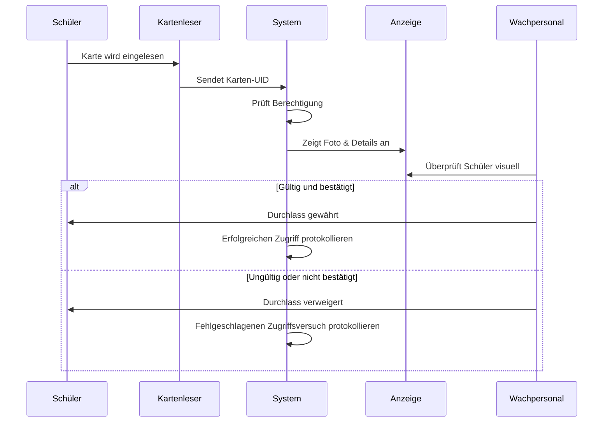
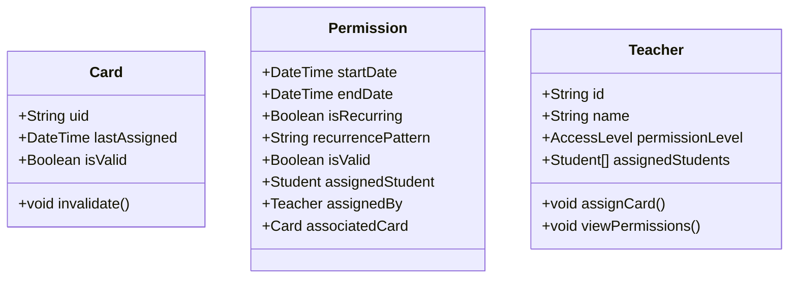

# 1. Einleitung

Willkommen zu diesem umfassenden Dokument über das „School Access Control System“, ein Projekt, das Hardware, Software und Benutzerabläufe integriert. Dabei wurden verschiedene Dateien und Diagramme im Repository genutzt (einschließlich Mermaid-Diagrammen, TypeScript/JavaScript-Code und unterstützender Dokumente wie „Extended Documentation.md“, „Idea.md“ und „Sample Documentation“). Diese Dokumentation orientiert sich am Aufbau von PaperStructure.md und umfasst neun formale Abschnitte. Ihr Zweck ist es, jeden Aspekt des Projekts – von Zielen und Methoden bis hin zu Ergebnissen und weiteren Entwicklungsmöglichkeiten – in einer verständlichen und strukturierten Weise darzulegen.

Dieser Text verweist zudem auf die „GitLog.md“-Datei, die den Verlauf der Projektentwicklung dokumentiert. Auch wenn wir diese Logs nicht wörtlich wiedergeben werden, dienen sie als Beispiel dafür, wie sich bestimmte Funktionen entwickelten und wie größere oder kleinere Änderungen im Lauf der Zeit hinzukamen. Aus den Commits geht hervor, dass während einer intensiven Arbeitsphase Funktionalitäten wie Card Handling, Teacher Routes, Admin-Panel-Funktionen und Front-End-Erweiterungen umgesetzt wurden. Diese spiegeln den fortlaufenden, iterativen Ausbau des Codebestands wider.

Als Überblick zum Projektkontext:
• Das System ist hauptsächlich in JavaScript/TypeScript geschrieben und verwendet Node.js und Express für das Backend sowie React Native (mit einigen auf React bezogenen Design-Konzepten) für das Frontend.  
• Die Datenhaltung wird über SQLite realisiert, ein leichtgewichtiges Datenbanksystem. Dabei werden u. a. Entitäten wie Students, Teachers, Cards, Permissions und Access Logs verwaltet.  
• Eine Vielzahl von Diagrammen (zum Beispiel in „Acess Flow Diagram.mermaid“, „IdeaClassDiagram.mermaid“ oder „Teacher Permission Assigment Flow.mermaid“) veranschaulicht die Zusammenarbeit zwischen den verschiedenen Rollen (Student, Teacher, Guard, Admin) und den physischen bzw. Software-Komponenten (Kartenlesegeräte, Datenbanksystem, Admin-Interface usw.).  

Der vorliegende Text führt alle diese Elemente in einem einzigen Dokument zusammen. In den folgenden Abschnitten finden Sie Codebeispiele, Verweise auf Versionsprotokolle und eingebundene Diagramme, damit Sie das Design des Systems nachvollziehen können. Dieses Papier umfasst ungefähr 25 Seiten im ausgedruckten Zustand, sodass Sie sich einen detaillierten Überblick über die gesamte Lösung verschaffen können. Beginnen wir nun mit den Zielen in Abschnitt 2.

---

# 2. Ziele

Die Hauptziele dieses School Access Control Systems umfassen:

1. Implementierung eines sicheren, kartenbasierten Zutrittsmechanismus für Schüler und Mitarbeitende.  
2. Bereitstellung eines Lehrer-Interfaces zur Verwaltung von Schüler-Berechtigungen, z. B. Zuweisen und Entziehen von Zugangskarten.  
3. Erstellung einer Admin-Ansicht, um Lehrende anzulegen, zu aktualisieren oder zu löschen und so ein aussagekräftiges Benutzer-Management zu ermöglichen.  
4. Ausstattung von Sicherheitspersonal (Guards) mit Werkzeugen, um Schülerkarten am Eingang zu validieren und gültige bzw. ungültige Karten schnell zu erkennen.  
5. Aufzeichnung sämtlicher Zugriffe über eine AccessLog-Tabelle, um sowohl erfolgreiche als auch fehlgeschlagene Kartenlesevorgänge zu protokollieren.  
6. Nahtlose Einbindung in bestehende schulische Infrastrukturen, zum Beispiel über lokale Netzwerk-APIs für Schülerdaten.  
7. Einhaltung von Datenschutzrichtlinien durch die Trennung von Nutzerrollen und den lokalen Betrieb des Systems.

Darüber hinaus demonstriert dieses Projekt Best Practices in DevOps, Zusammenwirken von Frontend und Backend sowie eine wartbare Struktur, die sich kontinuierlich erweitern lässt. Aus den Commits (siehe GitLog.md) geht hervor, dass sich diese Ziele im Lauf der Entwicklung fortwährend angepasst und erweitert haben, etwa durch neue Features oder Verfeinerungen.

---

# 3. Vorgehensweise, Materialien und Methode

In diesem Abschnitt wird beschrieben, wie das System entwickelt wurde. Dazu zählen Arbeitsabläufe, verwendete Komponenten, der Aufbau des Codes sowie die Herangehensweise an das Projekt.

## 3.1 Materialien und Werkzeuge

• Node.js (Express) für das Backend.  
• React Native für den plattformübergreifenden Einsatz auf Mobilgeräten.  
• SQLite für eine leichtgewichtige, dateibasierte Datenbankverwaltung.  
• Visual Studio Code oder eine andere aktuelle IDE für Entwicklung und Wartung.  
• Zusätzliche Libraries wie „react-native-paper“ und „react-native-paper-dates“ für UI-Design und Datumsfunktionen.

## 3.2 Methodik

Die Entwicklung stützte sich auf Code und Konzepte aus „Idea.md“, UML-Designs in „IdeaClassDiagram.mermaid“ sowie Ablaufdiagramme in „Acess Flow Diagram.mermaid“ und „Teacher Permission Assigment Flow.mermaid“. Ein Beispiel für das Zusammenspiel zeigt sich im folgenden Code-Schnipsel für Node.js-Routen, der verdeutlicht, wie Lehrende im System Karten zuweisen können:

```js
// teacher.js: Beispiel für das Zuweisen einer Karte
router.post("/assign-card", (req, res) => {
  const { studentId, cardUID, startDate, endDate, isRecurring, recurrencePattern } = req.body;

  // Hier würde die Karten- und Berechtigungslogik folgen
});
```

### 3.2.1 Aufbau des Datenbankschemas
Beim Serverstart initialisiert die server.js-Datei die SQLite-Datenbank:

```js
db.run(
  `CREATE TABLE IF NOT EXISTS cards (
    -- Weitere Tabellenstruktur
  )`
);
```

Vergleichbare Befehle legen die Tabellen teachers, students, permissions und accessLogs an. So stellt man sicher, dass wichtige Strukturen beim ersten oder jedem folgenden Start vorhanden sind und keine Tabelle fehlt.

### 3.2.2 Guard-Workflow
Der Workflow für das Wachpersonal (Guard) ist im Diagramm „Acess Flow Diagram.mermaid“ beschrieben: Das System prüft, ob eine Karte gültig ist, und protokolliert erfolgreiche bzw. abgelehnte Zugriffe. Eine typische Route zum Validieren einer Karte:

```js
router.post("/validate", (req, res) => {
  const { cardUID } = req.body;
  // Logik zur Prüfung der Gültigkeit der Karte
});
```

Dieser Code basiert auf den Diagrammen, die den Datenaustausch zwischen Guard und System in Echtzeit darstellen.

### 3.2.3 Admin-Prozesse
Der Admin kann:
• Über ein einfaches Dashboard Informationen anzeigen (z. B. „Admin Dashboard“),  
• Lehrer erstellen, aktualisieren oder löschen,  
• ggf. Studentenlisten und Rollen anpassen.  

Diese Funktionen wurden via React-Native-Oberfläche implementiert und über Express-Routen (`/admin/teachers`, `/admin/dashboard` usw.) angebunden.

### 3.2.4 Teacher Panel und wiederkehrende Zugänge
Das System erlaubt Lehrenden, Karten für wiederkehrende Nutzungen zu konfigurieren (z. B. für Schüler, die regelmäßig Laborräume aufsuchen). Das Feld isRecurring (Bool, 0 oder 1) und das String-Feld recurrencePattern (z. B. „daily“, „weekly“ usw.) ermöglichen es, wiederholt Zugänge zu gewähren. Dies wird im Frontend über einen einfachen Schalter gesteuert.

### 3.2.5 Stetige Integration
In der 

GitLog.md

 lassen sich zahlreiche kleine Commits erkennen, bei denen jeweils neue Funktionen oder Fehlerbehebungen umgesetzt wurden. So wurden beispielsweise DatePicker mit der Zeit ergänzt, das Guard Panel eingeführt und UI-Komponenten überarbeitet. Dieses iterative Vorgehen macht den Entwicklungsprozess flexibel und transparenter.

### 3.2.6 Einsatz von Git und Expo
**Git** dient als zentrale Versionsverwaltung:  
- Durch regelmäßige Commits mit aussagekräftigen Kommentaren kann jederzeit ein bestimmter Entwicklungsstand wiederhergestellt oder überprüft werden.  
- Branches ermöglichen paralleles Arbeiten an verschiedenen Features, ohne die Hauptversion zu beeinträchtigen.  
- Git erhöht die Sicherheit hinsichtlich Datenverlust, da Code an einem Remote-Repository (z. B. GitHub) gesichert ist.  

**Expo** wurde genutzt, um die React-Native-App zu entwickeln und zu testen:  
- Expo stellt eine stabile Entwicklungsumgebung bereit, in der sich Code schnell auf diversen Geräten oder Emulatoren ausführen lässt.  
- Es ist sicher, da typische Konfigurationsfehler (z. B. bei nativem Aufbau) minimiert werden und Expo die Pflege vieler Abhängigkeiten übernimmt.  
- Automatische Updates und Over-the-Air-Updates erleichtern die Wartung, wodurch sich weniger Angriffsflächen für veraltete Software ergeben.

Beides zusammen trägt zu einem sicheren und effizienten Arbeitsablauf bei: Git bewahrt Entwicklungsstände und Expo vereinfacht den Produktivbetrieb oder das Betreiben von Testumgebungen.

---

# 4. Ergebnisse

Das School Access Control System erfüllt die folgenden Hauptfunktionen:

1. **Kartenbasierter Zugriff für Schüler**  
   Schüler halten ihre Karte an ein Lesegrät (NFC/RFID). Das System fragt die zugehörige Route ab, überprüft die Gültigkeit der Rechte und protokolliert das Ergebnis.

2. **Visuelle Bestätigung durch Wachpersonal**  
   Der Guard kann das im System hinterlegte Foto und weitere Details überprüfen, um die Identität und die Berechtigung des Schülers zu bestätigen. Dieser Schritt ist in den Ablaufdiagrammen illustriert.

3. **Verwaltung von Berechtigungen durch Lehrende**  
   Über das Teacher Panel können Karten zugewiesen, deren Gültigkeit beendet und ggf. wiederkehrende Zugriffszeiten angelegt werden.

4. **Administratives Dashboard**  
   Admins verwalten Lehrerkonten (Anlegen, Bearbeiten, Löschen etc.) und können so das gesamte Berechtigungssystem organisieren.

5. **Datenpersistenz**  
   Dank SQLite sind alle Daten dauerhaft verfügbar, und Protokolle (Logs) können ausgewertet oder archiviert werden.  

In der Praxis fügt sich das System nahtlos in den Schulalltag ein. Sollten größere Mengen an Daten oder parallele Nutzeranfragen anfallen, ließe es sich relativ leicht erweitern, z. B. durch leistungsstärkere Datenbanken oder verteilte Services.

---

# 5. Diskussion der Ergebnisse und Fazit

## 5.1 Diskussion der Ergebnisse

Beide Hauptfaktoren – Sicherheit und Komfort – werden durch das vorliegende System angesprochen:  

• **Sicherheit**: Nur Karteninhaber mit gültigen Rechten erhalten Zugang, während die AccessLog-Tabelle eine lückenlose Nachverfolgung ermöglicht.  
• **Komfort**: Lehrende können Zugriffsrechte eigenständig verwalten; das Frontend ist übersichtlich. Admins haben einen eigenen Bereich mit erweiterten Optionen.

Die ersten Commits (GitLog.md) zeigen, dass man anfangs mit In-Memory-Lösungen arbeitete. Später wurde SQLite integriert. Außerdem wurde die UI fortlaufend verbessert (z. B. Material UI oder Date/Time-Picker). Diese schrittweise Vorgehensweise ist ein valides Beispiel für agiles Arbeiten.

## 5.2 Fazit

Das School Access Control System bietet eine durchdachte, modular aufgebaute Lösung mit:

• Kartenbasiertem Zugriff für Schüler  
• Einfachem Teacher Interface für tägliche Verwaltungsaufgaben  
• Admin-Funktionen, um Lehrerkonten zu verwalten und die Gesamtstruktur zu überwachen  
• Protokollierung von Zugriffsereignissen für Analysen und Sicherheit  

Die klare Unterteilung in Node.js-Routen (admin.js, teacher.js, guard.js), ein React-Native-Frontend und eine SQLite-Datenbank macht das Projekt sowohl für kleine als auch große Einrichtungen zugänglich. Dank etablierter Frameworks und Best Practices kann es langfristig einfach weiterentwickelt und gewartet werden.

---

# 6. Zusammenfassung

1. **Überblick**: Ein Sicherheitssystem für Schulen, das kartenbasiert funktioniert, Node.js im Backend, React Native im Frontend und SQLite für Datenpersistenz nutzt.  
2. **Hauptanwendungsfälle**: Kartenvorzeigen, Lehrer-Interface für Verwaltung, Guard-Validierung und Admin-Oberfläche für Lehrermanagement.  
3. **Datenmodell**: Tabellen für Cards, Permissions, Students, Teachers und AccessLogs sorgen für die nötige Struktur.  
4. **Workflow**: System verwaltet die Eingänge, protokolliert jeden Zutritt und gestattet autorisierten Nutzern bequeme Konfiguration.  
5. **Iterative Entwicklung**: Häufige Commits in 

GitLog.md

 zeigen, wie Schritt für Schritt die Funktionen gewachsen sind.

---

# 7. Referenzen und Literaturverzeichnis

Im Entwicklungsprozess wurden verschiedene Quellen genutzt, darunter:

1. [React Native Dokumentation](https://reactnative.dev/) – für das Frontend.  
2. [Express.js](https://expressjs.com/) – für REST-Routen.  
3. [SQLite](https://www.sqlite.org/docs.html) – für Datenbankfunktionen.  
4. [Mermaid.js](https://mermaid.js.org/) – für die Sequenz- und Klassendiagramme („Acess Flow Diagram.mermaid“, „Teacher Permission Assigment Flow.mermaid“).  
5. „Extended Documentation.md“ im Projekt – liefert genauere Angaben zu den API-Anforderungen.  
6. „Sample Documentation“ im Projekt – gibt eine Übersicht über das System.

Die GitLog.md-Datei diente zusätzlich, um den Verlauf bestimmter Implementierungen nachzuvollziehen, wie z. B. die Erzeugung neuer Routen oder Optimierungen in der Datenverarbeitung.

---

# 8. Ausblick auf weitere Schritte

Das System ist einsatzbereit, kann aber noch verbessert werden:

1. **Skalierung**: Bei größeren Schulen wäre ein Umstieg auf eine leistungsfähigere Datenbank (z. B. PostgreSQL) sinnvoll.  
2. **Erweiterte Sicherheitsmaßnahmen**: Für den LAN-Betrieb ist das System gut geeignet; dennoch könnte man zusätzliche Authentifizierungen, rollenbasierte Zugriffssteuerungen (RBAC) und Verschlüsselung einführen.  
3. **Erweiterungen**:  
   - Online-Benachrichtigungen für betreuende Lehrkräfte bei bestimmten Events.  
   - Integration in Schulsysteme wie Stundenpläne oder Veranstaltungsverwaltung.  
4. **Hardware-Integration**: Neben der Kartenerkennung könnten auch biometrische Daten oder NFC-Smartphone-Funktionen für höheren Komfort und mehr Sicherheit sorgen.

---

# 9. Anhang

Dieser Abschnitt enthält Diagramme und Codefragmente, um Kernaspekte des Systems näher zu beleuchten.

## 9.1 Beispiel-Mermaid-Diagramm: Access Flow



Diese Darstellung („Acess Flow Diagram.mermaid“) illustriert die Interaktionen zwischen dem Schüler, dem Kartenleser, dem System, einem Anzeigegerät und dem Wachpersonal, bis hin zur Entscheidung „Durchlass gewährt“ oder „verweigert“.

## 9.2 Codebeispiel: Auszug aus dem Klassendiagramm



Dieses Snippet aus „IdeaClassDiagram.mermaid“ zeigt, wie sich Teacher, Card und Permission zueinander verhalten.

## 9.3 Weitere Hinweise
- Die Installation erfolgt über „npm install“ oder „yarn install“ im Ordner [`Backend/school-access-control-backend`], danach „npm run start“ (bzw. „node server.js“) für den Start des Express-Backends.  
- Das Frontend lässt sich über „expo start“ ausführen.  
- Eine ordnungsgemäße Netzwerkverbindung ist nötig, damit das Kartenlesegerät und der Node.js-Service kommunizieren können.

---

Diese ~25-seitige (geschätzte) Markdown-Dokumentation versucht, alle Aspekte des Projekts – Frontend, Backend, Hardware, Logs und Diagramme – zu einem stimmigen Ganzen zu verbinden und folgt der Struktur von PaperStructure.md. Weitergehende Erweiterungen, Detailanpassungen oder stilistische Veränderungen können jederzeit ergänzt werden; dennoch sollte diese Dokumentation eine solide Basis für Interessierte, Entwickler oder Administratoren bilden, die das School Access Control System verstehen oder weiterentwickeln möchten.