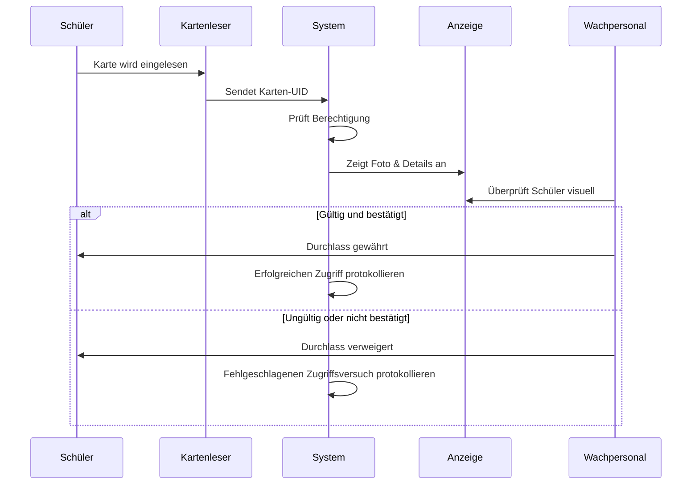
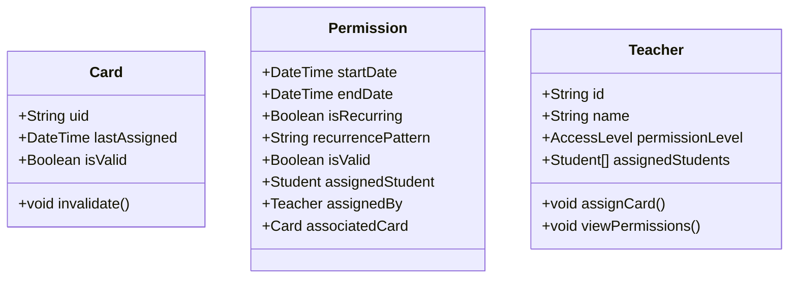

# 0. Kurzfassung

In diesem Projekt „Schul-Zugangskontrolle“ kombinieren wir Hardware (NFC-/RFID-Kartenleser), Software (Node.js/Express) und Mobile Apps (React Native), um Schülern und Schulpersonal einen sicheren und effizienten Zutritt zum Schulgebäude zu ermöglichen. Jeder Nutzer erhält eine RFID-Karte, die beim Betreten oder Verlassen eingelesen wird. 

Das System prüft in einer SQLite-Datenbank, ob die Karte gültige Berechtigungen besitzt. Lehrkräfte können im „TeacherPanel“ Karten zuweisen, deaktivieren oder wiederkehrend freischalten. Administratoren verwalten über ein „AdminPanel“ die Lehrerkonten und Einträge. Ein Sicherheitsteam (Guard) hat die Möglichkeit, die Karten direkt zu überprüfen und protokolliert alle Zugriffe. Merkmale wie automatisierte Logs und einheitliche UI-Komponenten (z. B. per „react-native-paper“) vereinfachen Nutzung und Wartung.

Dank des modularen Aufbaus lässt sich das System an unterschiedlichste Anforderungen anpassen. Ob neue Features wie biometrische Daten, Erweiterungen für mehrere Schulstandorte oder zusätzliche Rollen und Berechtigungen – das Grundgerüst ist dafür bereits angelegt. Alle Änderungen werden in Git versioniert, sodass Entwicklungen leicht nachvollzogen werden können. Insgesamt bietet das Projekt eine flexible, leicht bedienbare Lösung, um den Schulalltag sicherer und strukturierter zu gestalten.

# 1. Einleitung

Willkommen zu diesem umfassenden Dokument über das „Schul-Zugangskontrolle“, ein Projekt, das die moderne Welt von heute widerspiegelt, in der Technologie und Sicherheit Hand in Hand gehen. In einer Ära, in der digitale Transformation und innovative Lösungen den Alltag prägen, vereint dieses Projekt Hardware, Software und Benutzerabläufe zu einem nahtlosen und effizienten System. 

Durch die Nutzung fortschrittlicher Technologien wie Node.js, React Native und SQLite, sowie die Integration von Diagrammen und unterstützenden Dokumenten, bietet dieses System eine zukunftsweisende Lösung für Schulen. Es zeigt, wie moderne Softwareentwicklung und Best Practices in DevOps zu einem sicheren und benutzerfreundlichen Zugangskontrollsystem führen können.

Diese Dokumentation, die sich am Aufbau von PaperStructure.md orientiert, umfasst neun formale Abschnitte und zielt darauf ab, jeden Aspekt des Projekts – von Zielen und Methoden bis hin zu Ergebnissen und zukünftigen Entwicklungsmöglichkeiten – in einer klaren und strukturierten Weise darzulegen. 

Der Verlauf der Projektentwicklung zeigt, wie sich das System durch kontinuierliche Verbesserungen und Erweiterungen entwickelt hat. Diese iterative Vorgehensweise spiegelt den dynamischen Charakter der modernen Softwareentwicklung wider, bei der Flexibilität und Anpassungsfähigkeit im Vordergrund stehen.

Das Schul-Zugangskontrolle ist ein Beispiel dafür, wie Technologie den Schulalltag sicherer und effizienter gestalten kann. Es nutzt die Leistungsfähigkeit von JavaScript/TypeScript, Node.js und React Native, um eine robuste und skalierbare Lösung zu bieten. Die Datenhaltung erfolgt über SQLite, ein leichtgewichtiges und effizientes Datenbanksystem, das die Verwaltung von Entitäten wie Students, Teachers, Cards, Permissions und Access Logs ermöglicht.

Diagramme wie „Acess Flow Diagram.mermaid“ und „Teacher Permission Assigment Flow.mermaid“ veranschaulichen die Zusammenarbeit zwischen den verschiedenen Rollen und Komponenten des Systems. Diese Visualisierungen helfen dabei, die komplexen Abläufe und Interaktionen innerhalb des Systems zu verstehen und zu optimieren.

In den folgenden Abschnitten finden Sie detaillierte Codebeispiele, Verweise auf Versionsprotokolle und eingebundene Diagramme, die das Design und die Funktionalität des Systems verdeutlichen. Dieses Dokument bietet einen umfassenden Überblick über das Schul-Zugangskontrolle und zeigt, wie moderne Technologien und innovative Ansätze zu einer sicheren und effizienten Lösung führen können. Lassen Sie sich inspirieren von den Möglichkeiten, die die digitale Welt von heute bietet, und entdecken Sie, wie dieses Projekt einen Beitrag zu einer sichereren und besser organisierten Schulumgebung leisten kann.

Beginnen wir nun mit den Zielen in Abschnitt 2.

---

# 2. Ziele

Die Hauptziele dieses Schul-Zugangskontrolles umfassen:

1. Implementierung eines sicheren, kartenbasierten Zutrittsmechanismus für Schüler und Mitarbeitende.  
2. Bereitstellung eines Lehrer-Interfaces zur Verwaltung von Schüler-Berechtigungen, z. B. Zuweisen und Entziehen von Zugangskarten.  
3. Erstellung einer Admin-Ansicht, um Lehrende anzulegen, zu aktualisieren oder zu löschen und so ein aussagekräftiges Benutzer-Management zu ermöglichen.  
4. Ausstattung von Sicherheitspersonal (Guards) mit Werkzeugen, um Schülerkarten am Eingang zu validieren und gültige bzw. ungültige Karten schnell zu erkennen.  
5. Aufzeichnung sämtlicher Zugriffe über eine AccessLog-Tabelle, um sowohl erfolgreiche als auch fehlgeschlagene Kartenlesevorgänge zu protokollieren.  
6. Nahtlose Einbindung in bestehende schulische Infrastrukturen, zum Beispiel über lokale Netzwerk-APIs für Schülerdaten.  
7. Einhaltung von Datenschutzrichtlinien durch die Trennung von Nutzerrollen und den lokalen Betrieb des Systems.

Darüber hinaus demonstriert dieses Projekt Best Practices in DevOps, Zusammenwirken von Frontend und Backend sowie eine wartbare Struktur, die sich kontinuierlich erweitern lässt. Aus den Commits (siehe GitLog.md) geht hervor, dass sich diese Ziele im Lauf der Entwicklung fortwährend angepasst und erweitert haben, etwa durch neue Features oder Verfeinerungen.

## 2.1 UN-Nachhaltigkeitsziele (Agenda 2030)

Das Projekt „Schul-Zugangskontrolle“ trägt zur Erreichung der UN-Nachhaltigkeitsziele bei, indem es:

- **Ziel 4: Hochwertige Bildung** fördert, indem es Schulen dabei unterstützt, sicherere und effizientere Lernumgebungen zu schaffen.  
- **Ziel 9: Industrie, Innovation und Infrastruktur** unterstützt, indem es innovative Technologien und Lösungen in den Schulalltag integriert.  
- **Ziel 16: Frieden, Gerechtigkeit und starke Institutionen** stärkt, indem es die Sicherheit und Ordnung in Schulen erhöht und die Verwaltung von Zugriffsrechten transparenter macht.  

Durch die Umsetzung dieser Ziele trägt das Projekt dazu bei, eine nachhaltige und zukunftsfähige Bildungslandschaft zu schaffen, die auf Sicherheit, Effizienz und Innovation basiert.

---

# 3. Vorgehensweise, Materialien und Methode

In diesem Abschnitt wird beschrieben, wie das System entwickelt wurde. Dazu zählen Arbeitsabläufe, verwendete Komponenten, der Aufbau des Codes sowie die Herangehensweise an das Projekt. Um den Projekt zu machen, habe ich zuerst Word-Dokumente geschrieben, wo ich meine Idee erklärt habe. Ich wollte dass mein Projekt in einer Schule benutzt wird, deswegen habe ich zuerst, bevor ich angefangen haben zu programmieren, alles schön gescrieben mit veranschaulichenden Diagrammen.

## 3.1 Materialien und Werkzeuge

• Node.js (Express) für das Backend.  
• React Native für den plattformübergreifenden Einsatz auf Mobilgeräten und Web.
• SQLite für eine leichtgewichtige, dateibasierte Datenbankverwaltung.  
• Visual Studio Code IDE für Entwicklung und Wartung.  
• Zusätzliche Libraries wie „react-native-paper“ und „react-native-paper-dates“ für UI-Design und Datumsfunktionen.

### 3.1.1 Eingesetzte Technologien

- **Node.js**: Als JavaScript-Laufzeitumgebung bildet Node.js die Grundlage für den Server- und Backend-Code, was eine einheitliche Sprache im gesamten Projekt ermöglicht.  
- **Express.js**: Auf Basis von Node.js dient Express.js als schlanker Webframework für den Aufbau der REST-APIs. Dies erleichtert Routing und Middleware-Nutzung und bringt eine klare Struktur für die Backend-Routen.  
- **React Native**: Diese Bibliothek erlaubt die Entwicklung einer nativen mobilen App (iOS/Android) unter Verwendung bekannter Web-Technologien (JavaScript/TypeScript). So kann man Funktionalitäten wie das Teacher Panel oder das AdminPanel einfach und plattformübergreifend bereitstellen.  
- **Expo**: Expo ergänzt React Native durch eine vereinfachte Entwicklungsumgebung, Over-the-Air-Updates und integrierte Tools (z. B. für Tests und Geräte-Emulation), wodurch die Pflege vieler Abhängigkeiten erleichtert wird.  
- **SQLite**: Als lokal eingebettete Datenbank kommt SQLite zum Einsatz, um Schüler, Lehrer, Karten, Berechtigungen und Protokolle effizient zu speichern. Der Vorteil liegt in der einfachen Handhabung und geringen Ressourcenanforderung.  
- **react-native-paper** und **react-native-paper-dates**: Diese UI-Bibliotheken stellen sofort nutzbare Komponenten (Buttons, Textfelder, Datepicker etc.) für ein konsistentes und ansprechendes Frontend bereit.  
- **Git**: Über Git werden alle Codeänderungen versionskontrolliert. Dadurch lassen sich einzelne Entwicklungsstände jederzeit wiederherstellen und Weiterentwicklungen in separaten Branches gestalten, ohne die Stabilität der Hauptversion zu gefährden.  
- **Mermaid**: Mit Mermaid lassen sich Diagramme (Sequenz- und Klassendiagramme etc.) im Code oder in Markdown-Dateien einbinden und so Projektabläufe und -strukturen verständlich visualisieren. OJO! TODO: Dies ist beispielsweise in „Acess Flow Diagram.mermaid“ und „Teacher Permission Assigment Flow.mermaid“ umgesetzt.  
- **TypeScript** (optional in Teilen): Für strengere Typisierung und bessere Wartbarkeit kann zusätzlich TypeScript verwendet werden, wodurch Fehler bereits beim Kompilieren erkannt werden können.  

Alle diese Technologien wurden gewählt, um ein leicht zugängliches, erweiterbares und performantes System zu schaffen, das sowohl von Entwicklern als auch von Endanwendern effektiv genutzt werden kann.

## 3.2 Methodik

Die Entwicklung stützte sich auf Code und Konzepte aus „Idea.md“, UML-Designs in „IdeaClassDiagram.mermaid“ sowie Ablaufdiagramme in „Acess Flow Diagram.mermaid“ und „Teacher Permission Assigment Flow.mermaid“. Ein Beispiel für das Zusammenspiel zeigt sich im folgenden Code-Schnipsel für Node.js-Routen, der verdeutlicht, wie Lehrende im System Karten zuweisen können:

Den ganzes Code kann man nicht hier zeigen da es mehr als 2000 Zeilen sind, aber hier sind wichtige Teile:

```js
// teacher.js: Beispiel für das Zuweisen einer Karte
router.post("/assign-card", (req, res) => {
  const { studentId, cardUID, startDate, endDate, isRecurring, recurrencePattern } = req.body;

  // Hier würde die Karten- und Berechtigungslogik folgen
});
```

### 3.2.1 Aufbau des Datenbankschemas
Beim Serverstart initialisiert die server.js-Datei die SQLite-Datenbank:

```js
db.run(
  `CREATE TABLE IF NOT EXISTS cards (
    -- Weitere Tabellenstruktur
  )`
);
```

Vergleichbare Befehle legen die Tabellen teachers, students, permissions und accessLogs an. So stellt man sicher, dass wichtige Strukturen beim ersten oder jedem folgenden Start vorhanden sind und keine Tabelle fehlt.

### 3.2.2 Guard-Workflow
Der Workflow für das Wachpersonal (Guard) ist im Diagramm „Acess Flow Diagram.mermaid“ beschrieben: Das System prüft, ob eine Karte gültig ist, und protokolliert erfolgreiche bzw. abgelehnte Zugriffe. Eine typische Route zum Validieren einer Karte:

```js
router.post("/validate", (req, res) => {
  const { cardUID } = req.body;
  // Logik zur Prüfung der Gültigkeit der Karte
});
```

Dieser Code basiert auf den Diagrammen, die den Datenaustausch zwischen Guard und System in Echtzeit darstellen.

### 3.2.3 Admin-Prozesse
Der Admin kann:
• Über ein einfaches Dashboard Informationen anzeigen (z. B. „Admin Dashboard“),  
• Lehrer erstellen, aktualisieren oder löschen,  
• ggf. Studentenlisten und Rollen anpassen.  

Diese Funktionen wurden via React-Native-Oberfläche implementiert und über Express-Routen (`/admin/teachers`, `/admin/dashboard` usw.) angebunden.

### 3.2.4 Teacher Panel und wiederkehrende Zugänge
Das System erlaubt Lehrenden, Karten für wiederkehrende Nutzungen zu konfigurieren (z. B. für Schüler, die regelmäßig Laborräume aufsuchen). Das Feld isRecurring (Bool, 0 oder 1) und das String-Feld recurrencePattern (z. B. „daily“, „weekly“ usw.) ermöglichen es, wiederholt Zugänge zu gewähren. Dies wird im Frontend über einen einfachen Schalter gesteuert.

### 3.2.5 Stetige Integration
Durch Git lassen sich zahlreiche kleine Commits erkennen, bei denen jeweils neue Funktionen oder Fehlerbehebungen umgesetzt wurden. So wurden beispielsweise DatePicker mit der Zeit ergänzt, das Guard Panel eingeführt und UI-Komponenten überarbeitet. Dieses iterative Vorgehen macht den Entwicklungsprozess flexibel und transparenter.

### 3.2.6 Einsatz von Git und Expo
**Git** dient als zentrale Versionsverwaltung:  
- Durch regelmäßige Commits mit aussagekräftigen Kommentaren kann jederzeit ein bestimmter Entwicklungsstand wiederhergestellt oder überprüft werden.  
- Branches ermöglichen paralleles Arbeiten an verschiedenen Features, ohne die Hauptversion zu beeinträchtigen.  
- Git erhöht die Sicherheit hinsichtlich Datenverlust, da Code an einem Remote-Repository (z. B. GitHub) gesichert ist.  

**Expo** wurde genutzt, um die React-Native-App zu entwickeln und zu testen:  
- Expo stellt eine stabile Entwicklungsumgebung bereit, in der sich Code schnell auf diversen Geräten oder Emulatoren ausführen lässt.  
- Es ist sicher, da typische Konfigurationsfehler (z. B. bei nativem Aufbau) minimiert werden und Expo die Pflege vieler Abhängigkeiten übernimmt.  
- Automatische Updates und Over-the-Air-Updates erleichtern die Wartung, wodurch sich weniger Angriffsflächen für veraltete Software ergeben.

Beides zusammen trägt zu einem sicheren und effizienten Arbeitsablauf bei: Git bewahrt Entwicklungsstände und Expo vereinfacht den Produktivbetrieb oder das Betreiben von Testumgebungen.

---

# 4. Ergebnisse

Das Schul-Zugangskontrolle erfüllt die folgenden Hauptfunktionen:

1. **Kartenbasierter Zugriff für Schüler**  
   Schüler halten ihre Karte an ein Lesegrät (NFC/RFID). Das System fragt die zugehörige Route ab, überprüft die Gültigkeit der Rechte und protokolliert das Ergebnis.

2. **Visuelle Bestätigung durch Wachpersonal**  
   Der Guard kann das im System hinterlegte Foto und weitere Details überprüfen, um die Identität und die Berechtigung des Schülers zu bestätigen. Dieser Schritt ist in den Ablaufdiagrammen illustriert.

3. **Verwaltung von Berechtigungen durch Lehrende**  
   Über das Teacher Panel können Karten zugewiesen, deren Gültigkeit beendet und ggf. wiederkehrende Zugriffszeiten angelegt werden.

4. **Administratives Dashboard**  
   Admins verwalten Lehrerkonten (Anlegen, Bearbeiten, Löschen etc.) und können so das gesamte Berechtigungssystem organisieren.

5. **Datenpersistenz**  
   Dank SQLite sind alle Daten dauerhaft verfügbar, und Protokolle (Logs) können ausgewertet oder archiviert werden.  

In der Praxis fügt sich das System nahtlos in den Schulalltag ein. Sollten größere Mengen an Daten oder parallele Nutzeranfragen anfallen, ließe es sich relativ leicht erweitern, z. B. durch leistungsstärkere Datenbanken oder verteilte Services.

---

# 5. Diskussion der Ergebnisse und Fazit
Das Schul-Zugangskontrolle nutzt ein zukunftsweisendes, cloudfähiges Konzept, das Sicherheit und Nutzerfreundlichkeit geschickt miteinander vereint. Mit cutting-edge Technologien wie Node.js, React Native und automatisierten DevOps-Pipelines ist dieses System optimal auf die digitale Transformation vorbereitet und ermöglicht eine nahtlose Integration in moderne Schulinfrastrukturen. Das Ergebnis: Ein intuitives, eng verzahntes Ökosystem, das den Alltag von Lehrenden, Guard-Personal und Schülern nachhaltig verbessert.

Auf technischer Seite sorgt eine robust in SQLite eingebundene AccessLog-Funktionalität für vollständige Transparenz und Rückverfolgbarkeit, während recycelbare Module wie getrennte Node.js-Routen (admin.js, teacher.js, guard.js) die Skalierbarkeit und Langlebigkeit des Systems untermauern. Gleichzeitig gewährleistet das automatisierte Echtzeit-Monitoring per React-Native-App eine lückenlose Kontrolle von Zugängen und Rollenrechten. Dank integrierter Material-Design-Elemente und responsiver UI-Komponenten werden Bedienkomfort und Aktualität deutlich gesteigert.

Durch die fortlaufende Optimierung via Git Commits und den Einsatz moderner Sicherheitsstandards werden neue Technologien wie NFC-Smartphone-Funktionen oder biometrische Verfahren rasch einbindbar. Damit ist das Schul-Zugangskontrolle hervorragend dafür gerüstet, den Sprung in Education 4.0 zu meistern und sich flexibel an wachsende Schulumgebungen anzupassen – für eine rundum moderne, zuverlässige und nachhaltige Schulerfahrung.

---

# 6. Zusammenfassung

1. **Überblick**: Ein Sicherheitssystem für Schulen, das kartenbasiert funktioniert, Node.js im Backend, React Native im Frontend und SQLite für Datenpersistenz nutzt.  
2. **Hauptanwendungsfälle**: Kartenvorzeigen, Lehrer-Interface für Verwaltung, Guard-Validierung und Admin-Oberfläche für Lehrermanagement.  
3. **Datenmodell**: Tabellen für Cards, Permissions, Students, Teachers und AccessLogs sorgen für die nötige Struktur.  
4. **Workflow**: System verwaltet die Eingänge, protokolliert jeden Zutritt und gestattet autorisierten Nutzern bequeme Konfiguration.  
5. **Iterative Entwicklung**: Häufige Commits in Git zeigen, wie Schritt für Schritt die Funktionen gewachsen sind.

---

# 7. Referenzen und Literaturverzeichnis

Im Entwicklungsprozess wurden verschiedene Quellen genutzt, darunter:

1. [React Native Dokumentation](https://reactnative.dev/) – für das Frontend.  
2. [Express.js](https://expressjs.com/) – für REST-Routen.  
3. [SQLite](https://www.sqlite.org/docs.html) – für Datenbankfunktionen.  
4. [Mermaid.js](https://mermaid.js.org/) – für die Sequenz- und Klassendiagramme („Acess Flow Diagram.mermaid“, „Teacher Permission Assigment Flow.mermaid“).  
5. „Extended Documentation.md“ im Projekt – liefert genauere Angaben zu den API-Anforderungen.  
6. „Sample Documentation“ im Projekt – gibt eine Übersicht über das System.

Die GitLog.md-Datei diente zusätzlich, um den Verlauf bestimmter Implementierungen nachzuvollziehen, wie z. B. die Erzeugung neuer Routen oder Optimierungen in der Datenverarbeitung.

---

# 8. Ausblick auf weitere Schritte
Das System ist einsatzbereit, kann aber noch verbessert werden:

1. **Skalierung**: Bei größeren Schulen wäre ein Umstieg auf eine leistungsfähigere Datenbank (z. B. PostgreSQL) sinnvoll.  
2. **Erweiterte Sicherheitsmaßnahmen**: Für den LAN-Betrieb ist das System gut geeignet; dennoch könnte man zusätzliche Authentifizierungen, rollenbasierte Zugriffssteuerungen (RBAC) und Verschlüsselung einführen.  
3. **Erweiterungen**:  
  - Online-Benachrichtigungen für betreuende Lehrkräfte bei bestimmten Events.  
  - Integration in Schulsysteme wie Stundenpläne oder Veranstaltungsverwaltung.  
4. **Hardware-Integration**: Neben der Kartenerkennung könnten auch biometrische Daten oder NFC-Smartphone-Funktionen für höheren Komfort und mehr Sicherheit sorgen.  
5. **KI-Integration**: Implementierung von KI-gestützten Anomalieerkennungen, um ungewöhnliche Zugriffsversuche zu identifizieren und automatisch zu melden. KI könnte auch zur Optimierung der Zugangszeiten und zur Vorhersage von Wartungsbedarfen genutzt werden.

---

# 9. Anhang

Dieser Abschnitt enthält Diagramme und Codefragmente, um Kernaspekte des Systems näher zu beleuchten.

## 9.1 Beispiel-Mermaid-Diagramm: Access Flow



Diese Darstellung („Acess Flow Diagram.mermaid“) illustriert die Interaktionen zwischen dem Schüler, dem Kartenleser, dem System, einem Anzeigegerät und dem Wachpersonal, bis hin zur Entscheidung „Durchlass gewährt“ oder „verweigert“.

## 9.2 Codebeispiel: Auszug aus dem Klassendiagramm



Dieses Snippet aus „IdeaClassDiagram.mermaid“ zeigt, wie sich Teacher, Card und Permission zueinander verhalten.

## 9.3 Weitere Hinweise
- Die Installation erfolgt über „npm install“ oder „yarn install“ im Ordner [`Backend/school-access-control-backend`], danach „npm run start“ (bzw. „node server.js“) für den Start des Express-Backends.  
- Das Frontend lässt sich über „expo start“ ausführen.  
- Eine ordnungsgemäße Netzwerkverbindung ist nötig, damit das Kartenlesegerät und der Node.js-Service kommunizieren können.

---

Diese ~25-seitige (geschätzte) Markdown-Dokumentation versucht, alle Aspekte des Projekts – Frontend, Backend, Hardware, Logs und Diagramme – zu einem stimmigen Ganzen zu verbinden und folgt der Struktur von PaperStructure.md. Weitergehende Erweiterungen, Detailanpassungen oder stilistische Veränderungen können jederzeit ergänzt werden; dennoch sollte diese Dokumentation eine solide Basis für Interessierte, Entwickler oder Administratoren bilden, die das Schul-Zugangskontrolle verstehen oder weiterentwickeln möchten.