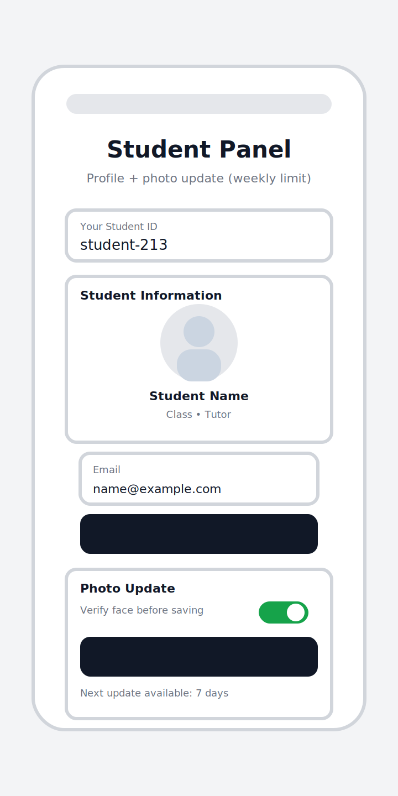
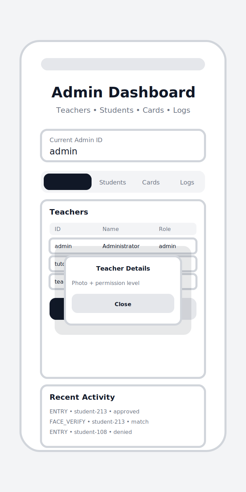
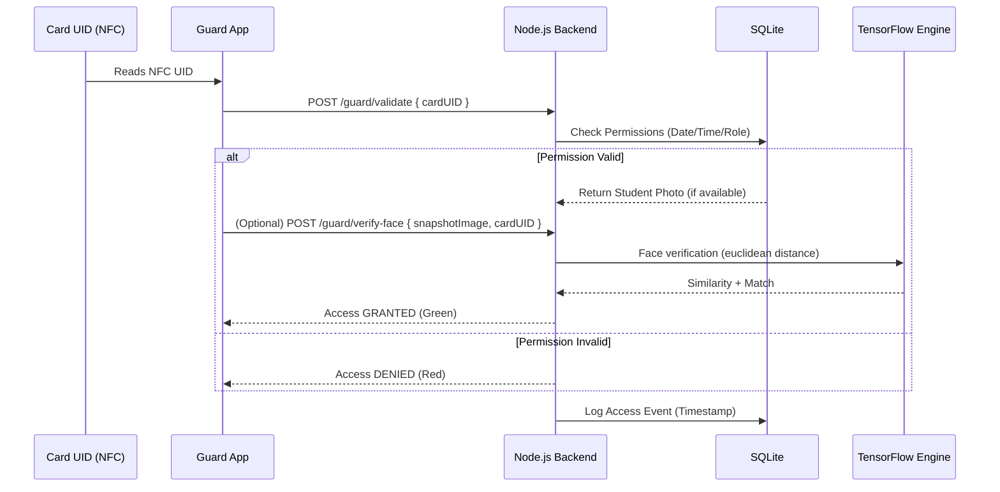

# Digital School Access Control (Schul-Zugangskontrolle)


> **A Full-Stack Biometric Security Ecosystem**
> Developed for **Jugend Forscht 2025** (Mathematics/Computer Science)
> *Awarded 1st Prize Regional Competition | Special National Prize for Digitalization*

## Overview

**Digital School Access Control** is a distributed security system designed to modernize educational infrastructure. It replaces traditional physical keys with a role-based access control (RBAC) ecosystem, integrating **NFC Hardware**, **AI-driven Verification**, and a **Cross-Platform Mobile App**.

The system solves the "security vs. convenience" trade-off by allowing teachers to manage recurring permissions algorithmically, while security guards utilize a dedicated tablet interface for real-time verification.

---

## Interface Preview

*The mobile application provides distinct interfaces based on the user's role (Student, Teacher, Guard, Admin).*

| **Guard Verification Panel** | **Student Panel** | **Admin Dashboard** |
| --- | --- | --- |
|  |  |  |
| *Card validation + optional face check* | *Profile + photo update flow* | *User/cards/logs management* |

---

## Tech Stack & Engineering

This project moves beyond simple scripting into a production-grade distributed architecture.

### **Core Backend**

* **Express.js:** RESTful API handling high-concurrency requests.
* **SQLite (`sqlite3`):** Local DB (`database.db`) for cards, students, teachers, permissions, and access logs.
* **Image Processing:** `heic-convert` + `sharp` to normalize uploads into resized PNG data-URIs.

### **AI & Machine Learning**

* **TensorFlow.js Node:** Server-side neural networks.
* **Face recognition:** `@vladmandic/face-api` + SSD Mobilenet v1 + landmark + recognition nets (server-side).

### **Mobile Frontend**

* **Expo:** Cross-platform deployment (iOS/Android).
* **TypeScript:** Strictly typed codebase for reliability.
* **React Native Paper:** Material Design implementation.

---

## System Architecture

The system relies on a strictly decoupled architecture, ensuring that the heavy lifting (AI processing, Image conversion) happens on the server, keeping the mobile client lightweight.



---

## Key Engineering Challenges

### 1. The "iPhone Problem" (HEIC Pipeline)

**Constraint:** iOS devices commonly provide photos as HEIC/HEIF, which many server-side CV libraries don’t accept directly.
**Solution:** Normalized incoming images on the backend.

* **Action:** Detects HEIC/HEIF via `data:image/heic|heif` data-URI prefixes.
* **Process:** Converts HEIC/HEIF to PNG in memory using `heic-convert`, then resizes with `sharp`.
* **Result:** Seamless cross-platform compatibility without user friction.

### 2. Preventing Memory Leaks in Node.js

**Constraint:** Server-side vision models and large images can increase memory pressure.
**Solution:** Added periodic memory logging and an image-normalization pipeline.

* **Code:** `utils/imageProcessor.js` converts images and resizes them to a fixed 1024×1024 PNG before face processing.

### 3. Recurring Permissions (Metadata)

**Constraint:** Some permissions repeat (e.g., weekly schedules).
**Current approach:** The backend stores `isRecurring` + `recurrencePattern` in the DB alongside a start/end window. (Recurrence evaluation can be extended beyond the current start/end checks.)

---

## Installation & Setup

### Backend

```bash
cd Backend/school-access-control-backend
# Node 22.x is recommended (see Backend/school-access-control-backend/README)
npm install

# If tfjs-node native bindings fail on your machine, rebuild from source
npm rebuild @tensorflow/tfjs-node --build-from-source

# Dev run (listens on :3000)
node server.js

# Optional: obfuscate + compile to ./dist, then run the compiled launcher
# npm run build
# npm run start:secure

```

### Mobile App

```bash
cd Frontend/SchoolAccessControl
npm install
npx expo start
# Scan QR code with Expo Go app

```

Note: the API base URL is configured in `Frontend/SchoolAccessControl/services/api.ts`.
Default backend is `http://localhost:3000` (the current app config uses localhost).

---

## Documentation

- See `Doku.md` and `DokuDeutsch.md` for written documentation.
- See `Extended Documentation.md` for deeper technical notes.
- The `.mermaid` files in the repo capture flows and diagrams.

---

## Repository Structure
* `Backend/` - Node.js Express API + TensorFlow.js 
* `Frontend/` - Expo/React Native mobile application
* `docs/` - Architecture diagrams and screenshots

---

## Roadmap

* [ ] **Live Video Recognition:** Migrate from static image verification to real-time video stream analysis.
* [ ] **PostgreSQL Migration:** Move from SQLite to Postgres for concurrent write scalability.

---

## Author

**Victor Gurbani**
[GitHub Profile](https://github.com/victor-gurbani)
